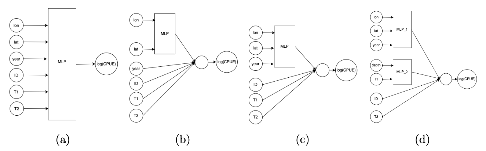

# Customized ANNs for CPUE Standardization

This repository contains the implementation of Customized Artificial Neural Networks (ANNs) or spatial-temporal ANNs for CPUE (Catch Per Unit Effort) standardization in fisheries management. The customized ANNs are tailored to address challenges related to overfitting and lack of interpretability, offering improved accuracy and insights into fish abundance trends (standardised CPUE) and distribution patterns. The dynamics of fish distribution and fishing locations for all three scenarios are available within the "additional figures" directory.

## Features
1. Customized ANNs tailored to specific fisheries and ecological systems
2. Incorporation of spatial-temporal modules for dynamic fish distribution patterns
3. Improved interpretability for a better understanding of underlying relationships
4. Resilience to overfitting, enhancing model generalization capabilities
   
To address the challenges of interpreting ANNs and mitigate overfitting caused by model complexity, we introduced two customized ANN models, namely, ANN S and ANN ST, based on assumptions on the dependence structure. 
ANN S has a spatial module taking the longitude and the latitude as the input, and the output of the spatial module is then fed to the output neuron together with other explanatory variables. 
This allows the catch to depend nonlinearly on the location, but the spatial distribution of
the fish is assumed to be the same for all years. On the other hand, the ANN ST model
includes a spatial-temporal module, which takes longitude, latitude, and year as inputs.
Unlike the spatial module that only considers spatial information, the spatial-temporal
module incorporates temporal information as well. This allows the model to account for
potential variations and trends in fish distribution that may occur over time, providing a
more comprehensive and dynamic representation of the data. The outputs of spatial and
spatial-temporal modules, f (lon, lat) and f (lon, lat, year), are then combined with other
variables respectively (a graphic comparison between these two modified ANNs and the
original ANN can be found in the figure beneath).

*ANN models with different structures. (a) ANN\_F model that treats all variables as inputs to an MLP. (b) ANN\_S model that only considers the longitude and latitude interactions, and then combines the output of an MLP with other variables. (c) ANN\_ST model that considers the space-time interactions. (d) An example of a customized ANN that includes multiple non-linear terms. The codes for constructing and executing the (c) structure are incorporated into the code directory.*

